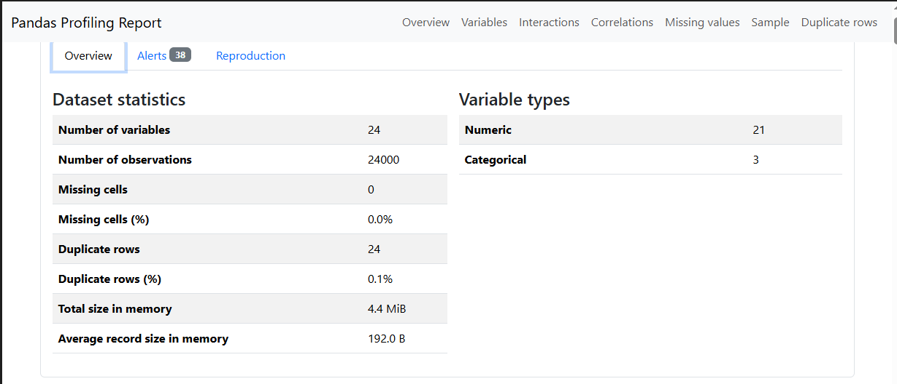
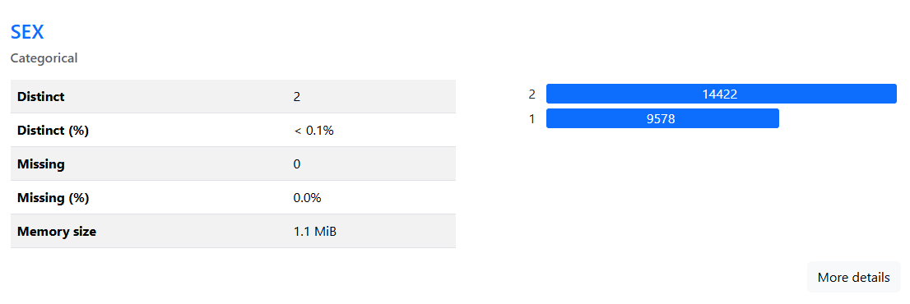
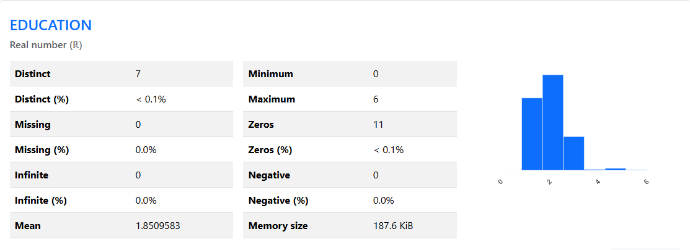
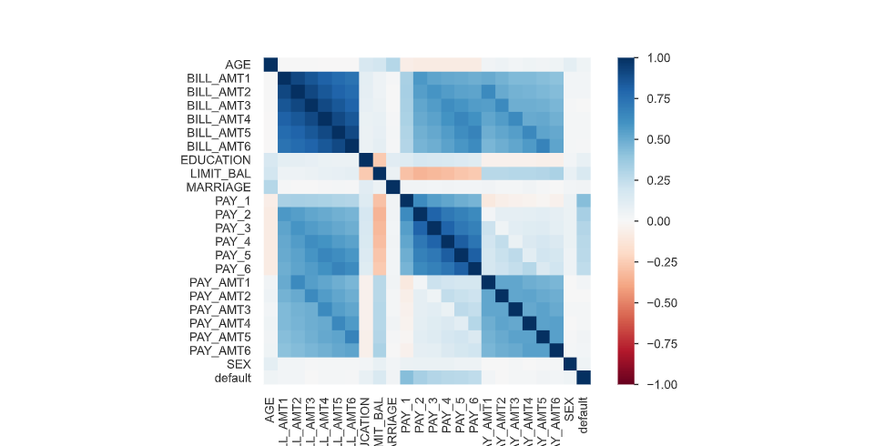

# 🐼 Pandas Profiling — Automated EDA in One Line

> **Stop writing exploratory code by hand. Let your data speak for itself.**

Pandas Profiling (now known as **YData Profiling**) is a powerful Python library that generates a comprehensive, interactive HTML report from any pandas DataFrame — in a single line of code. This project demonstrates its capabilities on a real-world **Credit Dataset**.

---

## 📌 Table of Contents

- [What is Pandas Profiling?](#what-is-pandas-profiling)
- [Why Use It?](#why-use-it)
- [Dataset](#dataset)
- [Installation](#installation)
- [Usage](#usage)
- [Report Highlights](#report-highlights)
- [Output Snapshots](#output-snapshots)
- [Key Insights from the Report](#key-insights-from-the-report)
- [Tech Stack](#tech-stack)
- [Author](#author)

---

## 🤔 What is Pandas Profiling?

**Pandas Profiling** automates the most tedious part of any data science project — Exploratory Data Analysis (EDA). Instead of writing dozens of lines of `df.describe()`, `df.isnull()`, `df.corr()`, and custom plots, you generate a full interactive report with:

```python
from ydata_profiling import ProfileReport

profile = ProfileReport(df, title="My Dataset Report")
profile.to_file("report.html")
```

That's it. One object. One method call. A complete analysis.

---

## 💡 Why Use It?

| Manual EDA | Pandas Profiling |
|---|---|
| Write code for every stat | Auto-generates everything |
| Separate plots for distributions | Interactive charts built-in |
| Easy to miss correlations | Full correlation matrix included |
| No missing value heatmap | Visual missing value analysis |
| Time-consuming | Done in seconds |

### What the report covers automatically:

- ✅ **Overview** — shape, memory usage, duplicates, missing values summary
- ✅ **Variable Analysis** — distribution, quantiles, descriptive stats per column
- ✅ **Correlations** — Pearson, Spearman, Cramér's V and more
- ✅ **Missing Values** — count, matrix, heatmap, dendrogram
- ✅ **Duplicate Rows** — full detection and preview
- ✅ **Interactions** — scatter plots between variable pairs

---

## 📂 Dataset

**File:** `credit.csv`

A credit card dataset containing customer demographic and financial information, commonly used for risk modeling and classification tasks.

| Column | Description |
|---|---|
| `SEX` | Gender of the customer |
| `EDUCATION` | Education level |
| `MARRIAGE` | Marital status |
| `AGE` | Age of the customer |
| `LIMIT_BAL` | Credit limit balance |
| `PAY_*` | Payment history (months) |
| `BILL_AMT*` | Bill statement amounts |
| `PAY_AMT*` | Payment amounts |
| `default.payment.next.month` | Target variable (1 = default) |

---

## ⚙️ Installation

```bash
# Install the library
pip install ydata-profiling

# Optional: for Jupyter notebook widget support
pip install ipywidgets
jupyter nbextension enable --py widgetsnbextension
```

> **Note:** The library was originally called `pandas-profiling`. It has been rebranded to `ydata-profiling`. Install `ydata-profiling` for the latest version.

---

## 🚀 Usage

```python
import pandas as pd
from ydata_profiling import ProfileReport

# Load dataset
df = pd.read_csv("credit.csv")

# Generate profile report
profile = ProfileReport(
    df,
    title="Credit Dataset — Pandas Profiling Report",
    explorative=True
)

# Save to HTML
profile.to_file("credit_report.html")

# Or display inline in Jupyter
profile.to_notebook_iframe()
```

See the full notebook: [`Pandas Profiling.ipynb`](./Pandas%20Profiling.ipynb)

---

## 📊 Report Highlights

### 1. 🗂️ Overview
A quick-glance summary of the entire dataset — number of rows, columns, missing cells, duplicate rows, and total memory usage.

### 2. 👤 Variable: SEX
Distribution analysis of the `SEX` column, showing the frequency breakdown of male vs. female customers with bar charts and percentage stats.

### 3. 🎓 Variable: EDUCATION
Breaks down customers by education level (Graduate School, University, High School, Others) with counts and visual distributions.

### 4. 🔗 Correlations
An interactive heatmap showing relationships between all numerical variables. High correlations between `BILL_AMT` columns across months are clearly visible.

### 5. ❓ Missing Values
Visual matrix and bar charts showing exactly where and how many values are missing across all columns — no guesswork needed.

### 6. 🔁 Duplicate Rows
Automatic detection and count of fully duplicated rows — important for data quality before modeling.

---

## 🖼️ Output Snapshots

### Overview


### Sex Variable Analysis


### Education Variable Analysis


### Correlation Heatmap


### Missing Values


### Duplicate Rows


---

## 🔍 Key Insights from the Report

- 📌 The dataset has **no significant missing values**, making it relatively clean for modeling.
- 📌 **Female customers slightly outnumber male** customers in this credit dataset.
- 📌 The majority of customers have a **University-level education**.
- 📌 Strong correlations exist between consecutive **BILL_AMT** columns — indicating payment behavior patterns over months.
- 📌 **Duplicate rows** were detected and flagged — these should be reviewed before model training.

---

## 🛠️ Tech Stack


- **Python 3.8+**
- **Pandas** — data manipulation
- **YData Profiling** — automated EDA report generation
- **Jupyter Notebook** — interactive development environment

---

## 👨‍💻 Author

**Md. Kamrul Islam**
- GitHub: [@Mdkamrulislam54](https://github.com/Mdkamrulislam54)

---

## ⭐ Show Your Support

If this project helped you understand Pandas Profiling, please consider giving it a **star ⭐** — it helps others discover this resource!

---

> *"The goal is to turn data into information, and information into insight."* — Carly Fiorina
